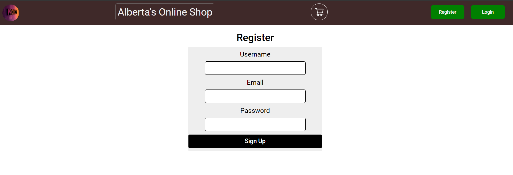
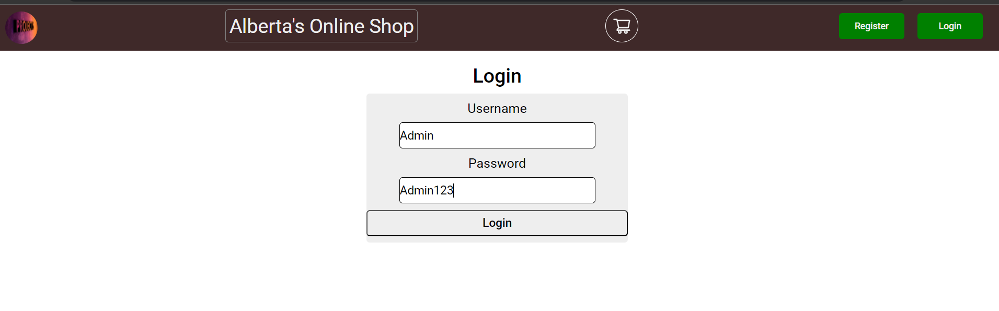
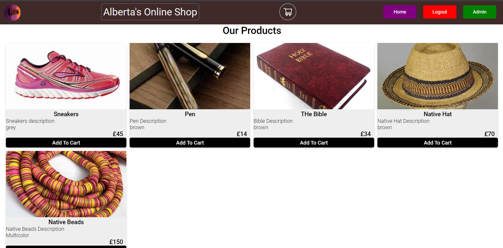
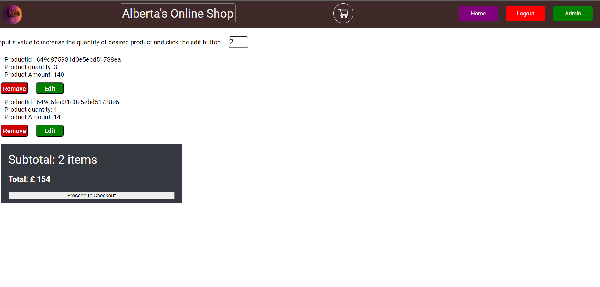
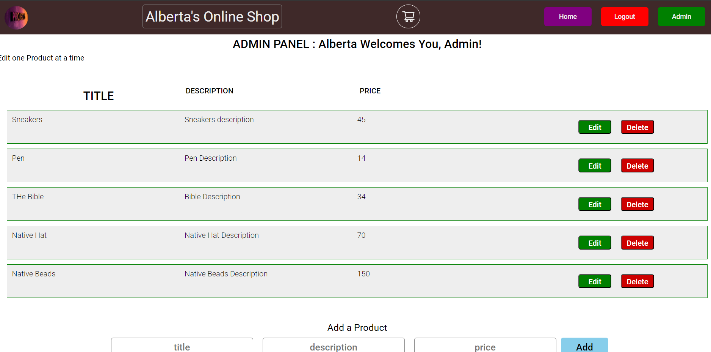

# MERN STACK APPLICATION

This application entails a full stack (front-end, back-end, and an admin panel).

## Note: Run this application locally before running the tests command to populate the products data.

## Table Of Contents

1. [Purpose of the application and use](#purpose-of-the-application-and-use)

   - Server

     - Server-side encryption as well as authentication for end user and admin.
     - Token verification, authentication, and authorization.
     - Routes protection
     - Database integration for all environments (test cases inclusive)
     - Middlewares and all packages used in the application.
     - How to install packages and run the server.

   - Client

     - Client-side authentication for an end user and admin.
     - Client Data storage and retrieval
     - Token - How to pass headers to requests - JWT
     - Routing and protection - react router dom
     - UI designs (Libraries used) - bootstrap
     - Pages
     - Usage of Admin Panel
     - Components Tree
     - HttpService
     - How to install packages and run the app.

2. [Front-End Components](#front-end-components)

   - User Interface (UI)
   - User Authentication
   - Event Listing
   - Event Registration
   - Admin Dashboard

3. [Back-End Components](#back-end-components)

   - Web Server
   - Application Server
   - Database
   - User Management
   - Event Management
   - APIs

4. [System Requirements](#system-requirements)

   - Node version 18.13.0
   - React 18

5. [Functional Requirements](#functional-requirements)

   - User Registration
   - Event Listing
   - Product CRUD Operations

6. [Non-Functional Requirements](#non-functional-requirements)

   - Performance
   - Security
   - Scalability

7. [System Architecture](#system-architecture)

8. [User Stories Examples](#user-stories-examples)

9. [Packages, Middlewares, Encryptions](#packages-middlewares-encryptions)

10. [Database](#database)

11. [Run Server side application locally](#run-server-side-application-locally)

    - Server setup instructions

12. [Run Client application locally](#run-client-application-locally)

    - Client setup instructions
    - User Login Details
    - Admin Login Details

13. [GitHub Links](#github-links)

    - Server repository
    - Client repository

14. [Deployed Links](#deployed-links)

    - Server deployment
    - Client deployment

15. [Note](#note)

    - Additional note about third-party APIs

16. [Testing](#testing)

    - Instructions for testing the application
    - Test case examples

17. [Credits](#credits)

## Purpose of the application and use

This application is a full-stack MERN (MongoDB, Express.js, React, Node.js) stack application that includes a front-end, back-end, and an admin panel. It provides a user interface for users to view listed events, sign up for events, manage their profiles, view products, add them to the cart, and delete them from the cart. The application also includes user authentication, user role management, event listing, event registration, and admin-specific functionalities for managing events.

### Server

The server-side of the application handles server-side encryption, authentication, and authorization for both end users and admins. It provides token verification, routes protection, and integrates with the database for all environments, including test cases. The server uses various middlewares and packages to implement its functionality.

Instructions on how to install packages and run the server are provided in the server setup section.

### Client

The client-side

of the application handles client-side authentication for both end users and admins. It manages client data storage and retrieval, token handling for requests using JWT (JSON Web Tokens), routing and protection using react-router-dom, and utilizes Bootstrap for UI designs. The client application consists of different pages and components, including the Admin Panel.

Instructions on how to install packages and run the client application are provided in the client setup section.

## Front-End Components

The front-end components of the application include:

- User Interface (UI): Provides an interactive interface for users to view listed events, sign up for events, manage their profiles, view products, add them to the cart, and delete them from the cart.
- User Authentication: Handles user registration, login, and user role management (user vs. admin).
- Event Listing: Displays upcoming events with relevant details such as title, date, image of products, color, prices, and description.
- Event Registration: Allows users to register for events and manage their event registrations.
- Admin Dashboard: Provides admin-specific functionalities to manage events, including event creation, editing, and deletion.

## Back-End Components

The back-end components of the application include:

- Web Server: Serves the front-end application and handles HTTP requests/responses.
- Application Server: Implements the business logic, processes user requests, and communicates with the database.
- Database: Stores user profiles, details, and other relevant data.
- User Management: Handles user registration, authentication, and authorization.
- Event Management: Provides CRUD (Create, Read, Update, Delete) operations for events, accessible only to admin users.
- APIs: Exposes necessary APIs for communication between front-end and back-end components.

## System Requirements

This application requires the following system requirements:

- Node version 18.13.0
- React 18

## System Architecture

## Functional Requirements

The functional requirements of the application include:

- User Registration: Users can create an account by providing their username, email address, and a password. Upon registration, users receive a confirmation email to verify their account.
- Event Listing: The application displays a list of products, showing key information like product title, color, description, and price.
- Product CRUD operations: Only logged-in users can view products, add them to the cart, and delete them from the cart. Only admins can create, update, and delete a product.

## Non-Functional Requirements

The non-functional requirements of the application include:

- Performance: The application should load quickly and respond to user interactions promptly. The system should be able to handle a large number of concurrent users without significant performance degradation.
- Security: User passwords should be securely stored using encryption techniques. Only authenticated users should have access to user-specific data and administrative functions.
- Scalability: The system architecture should be designed to handle increasing user and product volumes over time. The application should be easily scalable by adding more servers or utilizing cloud-based infrastructure.

## User Stories Examples

- As a user, I want to create an account so that I can buy a product.
- As a user, I want to view a list of products I can find on the website and order a product/item I need or like.
- As an admin, I want to be able to edit product details, including the product title, color, image, price, and description, so that I can keep the product information up to date.

## Packages, Middlewares, Encryptions

### Server Dependencies

```plaintext
"dependencies": {
    "bcrypt": "^5.1.0",
    "cors": "^2.8.5",
    "cross-env": "^7.0.3",
    "crypto-js": "^4.1.1",
    "define": "^1.0.1",
    "dotenv": "^

16.0.1",
    "express": "^4.18.1",
    "jsonwebtoken": "^8.5.1",
    "mongoose": "^6.4.1",
    "morgan": "^1.10.0",
    "nodemon": "^1.19.4"
}
```

### Client Dependencies

```plaintext
"dependencies": {
    "@testing-library/jest-dom": "^5.16.5",
    "@testing-library/react": "^13.4.0",
    "@testing-library/user-event": "^13.5.0",
    "bootstrap": "4.6.0",
    "react-bootstrap": "1.6.1",
    "react-icons": "4.2.0",
    "axios": "^1.4.0",
    "react": "^18.2.0",
    "react-dom": "^18.2.0",
    "react-router-dom": "^6.12.1",
    "react-scripts": "5.0.1",
    "web-vitals": "^2.1.4"
}
```

## Database

MongoDB is used for data storage.

## Run Server-side Application Locally

To run the server-side application locally, follow these steps:

1. Install dependencies:

```shell
npm install
```

2. Start the server:

```shell
npm start
```

Note: The `dbURI` in the `.env` file can be adjusted or replaced with your MongoDB Atlas connection string.

Example MongoDB connection URL:

```plaintext
dbURI = mongodb+srv://<username>:<password>@cluster0.xjdydm8.mongodb.net/Product?retryWrites=true&w=majority
```

Admin endpoints are protected with JWT, and products are created with headers and tokens.

## Run Client Application Locally

To run the client application locally, follow these steps:

1. Replace the `baseUrl` in `httpService.js` with `http://localhost:5000/api/`.

2. Install dependencies:

```shell
npm install
```

3. Start the client application:

```shell
npm start
```

### User Login Details

- Username: 'User'
- Password: 'User123'

### Admin Login Details

- Username: 'Admin'
- Password: 'Admin123'

### User/Admin Interaction Images

The following images are user/Admin interaction with the application interface.

# Register Page



# Login Page



# Homepage



# Cart Page



# Admin Page



# Product Image


## GitHub Links

- Server: [https://github.com/fakornamwealth/fullstack/tree/myprojects](https://github.com/fakornamwealth/fullstack/tree/myprojects)
- Client: [https://github.com/fakornamwealth/fullstack/tree/client](https://github.com/fakornamwealth/fullstack/tree/client)

## Deployed Links

- Server: [https://react-node-u6i6.onrender.com/api](https://react-node-u6i6.onrender.com/api) (deployed on render.com)
- Client: [https://648888f399c9d900080f712a--tranquil-stardust-8b019b.netlify.app/login](https://648888f399c9d900080f712a--tranquil-stardust-8b019b.netlify.app/login) (deployed on Netlify)

## Note

No third-party API was used in this project.

## Testing

To test the endpoints in this application, run the following command:

```shell
npm test
```

### Backend Testing

The backend test suite will test the following cases:

1. It should register + login a user, create a product, and verify the products in the database.
2. It should register + login a user, create a product, edit/update the product in the database.
3. It should register + login a user, create a product, and delete it from the database.

Note: The database must be emptied beforehand for the tests to pass.

### Frontend Testing

The frontend test suite will do a snapshot test of the Products components and also a unit test of the httpService.js functions generalRequest.get() and userRequest.get(). The assertion will check if the http response status equals 200.

## Credits

The MERN Stack Application utilizes various libraries, frameworks, and resources, including:

- React
- Node.js
- Express.js
- MongoDB
- Bootstrap
- React Router DOM
- JWT for token verification and encryption
